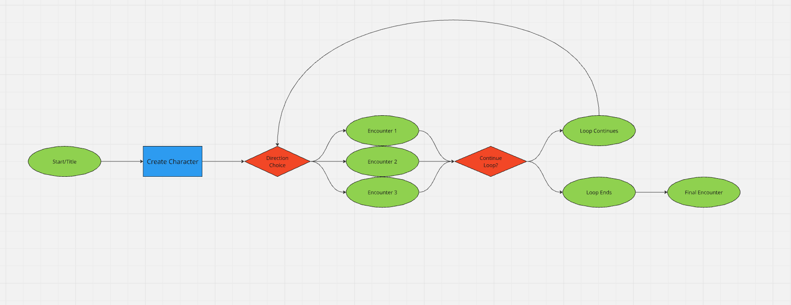
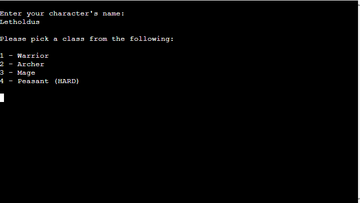
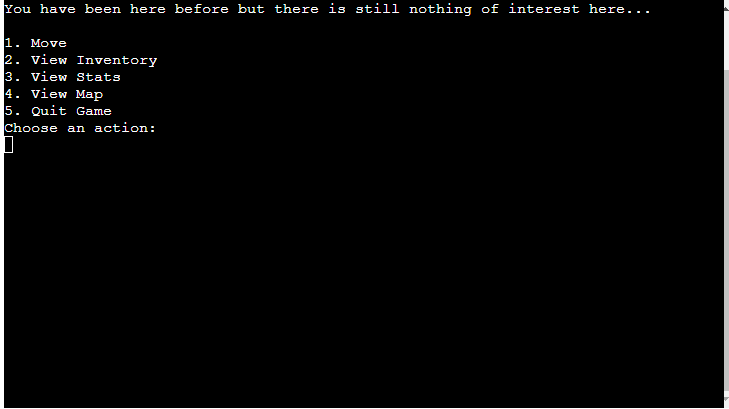
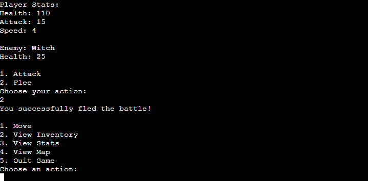
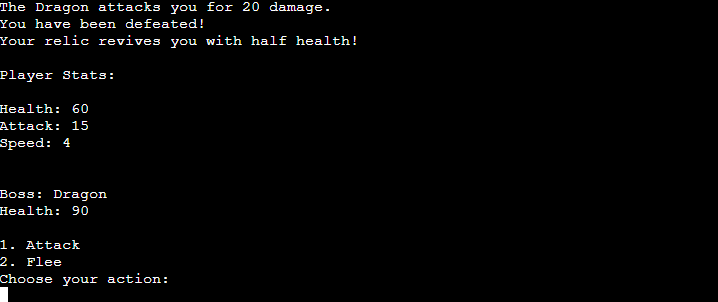
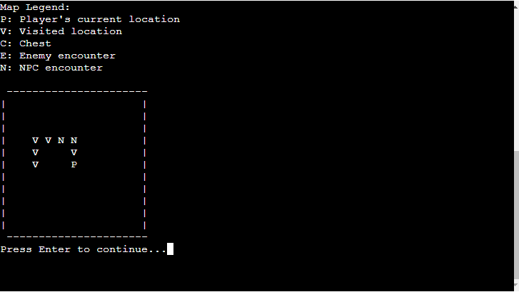

# Oathbound

A link to the deployed app is **[here](https://oathbound-53135a23d9e9.herokuapp.com/)**.

Oathbound is a straightforward text-based adventure game that immerses players in a fantasy world where they take on the role of a chosen character class. Players will navigate different environments, face various enemies, and make choices that affect their journey. While the game offers strategic elements like resource management and combat, it’s designed to be accessible and engaging without being overly complex. Oathbound provides a simple yet immersive experience, suitable for players who enjoy a blend of exploration and decision-making in a classic fantasy setting.

## Deployed App

  - This image shows the initial page the player sees

**Table of contents:**

- [Title](#guess-the-god)
- [User Experience](#user-experience-ux)
  - [Expectation](#expectation)
  - [User Journey](#user-journey)
- [Design](#design)
  - [Colour Scheme](#colour-scheme)
  - [Typography](#typography)
  - [Languages Used](#languages-used)
  - [Flowcharts](#flowcharts)
- [Features](#features)
  - [Languages Used](#languages-used)
  - [Existing Features](#existing-features)
  - [Features Not Yet Implemented](#features-not-yet-implemented)
- [Testing](#testing)
  - [Testing Table](#testing-table)
  - [Validator Testing](#validator-testing)
  - [Unfixed Bugs](#unfixed-bugs)
- [Deployment](#deployment)
- [Credits](#credits)
  - [Content](#content)
  - [Tools and Libraries](#tools-and-libraries)
  - [Acknowledgements](#acknowledgements)

## User Experience (UX)

  - ### Expectation
    - **Clear Instructions**: Users expect straightforward and detailed instructions on how to navigate and engage with the game’s various features.

    - **Simple Navigation**: Navigation of the game is simple and intuitive.

    - **Feedback**: Users anticipate immediate and meaningful feedback on their actions during gameplay, helping them understand the impact of their choices and strategies.

    - **Immersive Experience**: The game is designed to immerse players in a richly detailed fantasy world, with an emphasis on exploration, decision-making, and combat.

  - ### User Journey
    - **Title Screen**: Upon starting the game, users are introduced to the game’s world with a compelling title screen and an introductory narrative, setting the stage for the adventure ahead.

    - **Character Creation**: Users select their character’s name and class, with clear options to help them make a choice.

    - **Game Setup**: The game automatically generates the number of turns and starting location, creating a sense of unpredictability and excitement for the journey ahead.

    - **Main Gameplay Loop**: Players navigate through the world, encountering various challenges, enemies, and NPCs.  
    They are presented with options to move, view inventory, check stats, view the map, or quit the game.  
    The exploration is dynamic, with each move revealing new areas, encounters, and opportunities for strategic decisions.

    - **Combat and Encounters**: During encounters, users engage in combat with enemies or interact with NPCs.  
    The game provides clear choices and immediate feedback on the outcome of each action, whether it be battling a foe or discovering a hidden item.

    - **Boss Battle**: As the game progresses, users will face a final boss encounter, with the stakes clearly outlined.  
    The battle is a culmination of the player’s journey, testing their accumulated skills and resources.

    - **Completion**: Upon defeating the final boss or meeting an untimely end, users are presented with a concluding narrative and the option to restart the game or exit.

    - **Restart Option**: After the game concludes, users are given a clear option to restart their adventure or exit, ensuring a satisfying end to their experience.

## Design

  - ### Colour Scheme
    - The game is played entirely within a terminal so the colour scheme is simply the white text on a black background.

  - ### Typography
    - The game utilises the default monospace font typically associated with terminal environments.  
    
    - This font ensures that the text is easily readable and aligns with the retro, immersive aesthetic commonly associated with text-based adventure games.

  - ### Languages Used
    - **Python**: The game is built entirely in Python, a powerful programming language well-suited for developing interactive text-based games.  
      - Python's simplicity and readability make it an excellent choice for both game logic and narrative flow.
    
    - **Google Sheets API**: Google Sheets is used as a database to store and retrieve game data, such as character stats, enemies, items, and more. 
      - The Google Sheets API allows for dynamic interaction with this data, making the game adaptable and expandable.
    
    - **Markdown**: Used to write the README.

  - ### Flowcharts 

The flowcharts below visually represent the game's structure and logic, showcasing how different elements and decisions interact throughout the gameplay. These diagrams offer a clear overview of the game's progression, helping players and developers alike to understand the underlying mechanics.

#### Original Flowchart (Simple)

This initial flowchart illustrates the basic flow of the game. It starts with the title screen, followed by character creation. The player then makes a directional choice, leading to one of several possible encounters. The game loop continues through these encounters, with the player making decisions that either advance the game or lead to an end condition, culminating in the final encounter.

  **Explanation:**
  - **Start/Title:** The game begins with the title screen where the player starts their adventure.
  - **Create Character:** The player creates their character by choosing a name and class, which defines their initial stats and abilities.
  - **Direction Choice:** At each turn, the player chooses a direction to move in, leading to different encounters.
  - **Encounters:** The player may encounter various scenarios, such as enemies, NPCs, or treasures, depending on the direction chosen.
  - **Continue Loop:** The game loop continues until a certain condition is met, either continuing the adventure or leading to the final encounter.
  - **Final Encounter:** The game culminates in a final encounter, which determines the player's success or failure.

#### Final Flowchart (Full)

The full flowchart can be viewed in detail **[Here.](https://miro.com/app/board/uXjVKq_bneI=/?share_link_id=965597782529)**

The full flowchart provides a detailed view of the game's entire logic, encompassing all possible paths, encounters, and outcomes. This version delves into the complexity of the game, showing how different player decisions influence the game's direction, encounters, and eventual conclusion.

**Explanation:**
- **Expanded Detail:** Unlike the simple flowchart, this version includes every possible scenario the player might face, from the beginning of the game to the final encounter.
- **Decision Points:** It shows all the decision points, such as which direction to move, how to interact with NPCs, and whether to fight or flee during encounters.
- **Game Loop Complexity:** The flowchart highlights the complexity of the game loop, where each choice can lead to different outcomes, affecting the game's progression.
- **Branching Paths:** Multiple branching paths illustrate the game's replayability, where each playthrough can offer a unique experience based on the player's choices.
- **Final Encounter:** All paths ultimately lead to the final encounter, which is influenced by the player's previous decisions and actions throughout the game.

## Features

Below I will go into a brief explanation of the features I have encorporated into the game.

### Existing Features

- **Game Setup Features**

    - **Title Screen:**

      

      - The game starts with a title screen that displays the game's name in a stylised ASCII format, setting the mood for the adventure.
    
    - **Character Creation:**

      
      

      - Players are prompted to enter their character's name.
      - Players choose a class from options (e.g., Warrior, Archer, Mage, Peasant), each with its own unique stats and starting equipment.

    - **Initialisation:**

      

      - The game randomly determines the number of turns until the final boss encounter.
      - The player's inventory is initialised with basic equipment based on the chosen class.

- **Gameplay Features**

    - **Game Loop:**

      

      - The core loop of the game where the player makes decisions each turn until the final encounter.
      - **Actions Menu:**
        - **Move:** Players can move their character in one of four directions (North, South, East, West).
        - **View Inventory:** Players can view and manage their inventory.
        - **View Stats:** Players can check their current stats and equipment.
        - **View Map:** Players can view the map of visited locations and encounters.
        - **Quit Game:** Players can exit the game at any point.
    
    - **Exploration:**

      
      

      - As the player moves around, the game generates random areas (e.g., forests, lakes, mountains).
      - The player can revisit areas, and previously encountered locations are stored.
    
    - **Encounters:**

      - **Random Encounters:** As the player explores, they have a chance of encountering chests, enemies, or NPCs.

        

      - **Chests:** Players can choose to open them, which might result in finding items or triggering a mimic battle.

        

      - **Enemies:** Players engage in turn-based combat with various enemies.

        

      - **NPCs:** Players can interact with NPCs to receive hints, lore, and items.

    - **Combat System:**

      

      - **Turn-Based Combat:** Players choose to attack or flee. Players and enemies take turns based on their speed stat.

        

      - **Player Attack:** Players attack enemies, with a chance of a critical hit if applicable.
      - **Enemy Attack:** Enemies retaliate, dealing damage to the player.

        

      - **Fleeing:** Players can attempt to flee from the battle, though it may not always succeed.

        

      - **Defeat and Revival:** If the player is defeated but has a revival item, they are revived with partial health. Otherwise, the game ends.

- **Final Encounter Features**

  - **Boss Encounter:**

    

    - Upon reaching the final turn, the player encounters a randomly selected boss.
    - **Boss Battle:** The boss battle operates similarly to regular combat but with stronger enemies and no possibility to flee successfully.

      
  
    - **Victory:** Upon defeating the boss, the player is presented with a victory screen and congratulatory message.

      

    - **Defeat:** If the player is defeated, they are given the option to restart the game.

- **Inventory Management Features**

  - **Inventory System:**

    

    - Players can view their collected items, including weapons, armour, and relics.
    - **Equip Items:** Players can equip new items from their inventory, which will modify their stats.
    - **Unequip Items:** Players can remove currently equipped items and store them back in their inventory.
    - **Item Stats:** Each item in the inventory affects the player's stats, such as health, attack, and speed.

- **Map and Navigation Features**

  - **Dynamic Map:**

    

    - The game features a dynamic map that updates based on the player's exploration.
    - **Map Symbols:** Symbols represent different locations: 'P' for player, 'V' for visited locations, 'C' for chests, 'E' for enemies, and 'N' for NPCs.
    - **Map Legend:** A legend explains the symbols used on the map as above.

- **User Interface and Feedback Features**

  - **Scrolling Text:**
    - Important messages and narrative text are displayed with a scrolling effect, enhancing immersion.
  - **Immediate Feedback:**
    - Players receive immediate feedback on their actions, such as the outcome of battles, successful escapes, or loot from chests.
  - **Restart Option:**
    - Upon game over, players are given the option to restart the game or exit.

- **Miscellaneous Features**

  - **Healing Mechanism:**
    - The player heals 10% of their maximum health each time they move to a new location.
  - **Item Drops:**

    

    - Enemies and chests can drop items that are added to the player's inventory.

  - **Character Stats:**

    

    - Players can view detailed stats that update as they progress and acquire new items.

  - **Event Logging:**
    - Key events in the game, such as battles and encounters, are logged and influence subsequent gameplay.

- **Customisation and Randomisation Features**

  - **Randomised Boss Encounters:**
    - The final boss is selected randomly from a list of potential bosses, adding replayability.
  - **Random Areas and Encounters:**
    - Each playthrough offers a unique experience due to the random generation of areas and encounters.

- **Endgame and Replayability Features**

  - **Endgame Options:**
    - After defeating the boss or dying, the player can choose to restart the game or quit.
  - **Replayability:**
    - With randomised encounters, bosses, and loot, each playthrough offers a different experience.

### Features Not Yet Implemented

- __Visuals__

  - My intention was to implement ASCII art to improve the storytelling aspect of the game but due to time constraints and complexity of other features this was sidelined.

- __Comprehensive Combat__

  - The combat aspect was planned to be expanded upon to include an order of battle which would have taken advantage of the already implemented speed attribute.

- __Consumable Items__

  - I had intended to include consumable items such as health potions and enhancement items but I ended up using the heal per move feature that is in the finished game.

- __Expanded NPC Interactions__

  - Inclusion of NPC specific interactions such as unique combat encounters were planned to be included but again had to be dropped due to time constraints.

## Testing

### Testing Table

| **Feature**            | **Test Description**                                                   | **Pass/Fail** | **Comments**                                |
|------------------------|------------------------------------------------------------------------|---------------|---------------------------------------------|
| Character Creation     | Tested the character creation process, ensuring the user can choose a class and the correct stats are assigned. | Pass          | All classes were selectable, and stats were correctly applied. |
| Movement System        | Verified that the player can move in all four directions and that the map updates correctly. | Pass          | Movement worked as expected, and the map updated correctly. |
| Encounter System       | Ensured that encounters trigger correctly and that the correct encounter (enemy, chest, or NPC) appears. | Pass          | All encounters triggered appropriately based on the conditions. |
| Combat System          | Tested combat mechanics, including attacking, taking damage, and defeating enemies. | Pass          | Combat worked as expected, with correct health deductions and enemy defeat. |
| Inventory Management   | Verified that the player can view, equip, and unequip items from the inventory. | Pass          | Inventory management functioned correctly, with items equipping/unequipping as expected. |
| Boss Encounter         | Ensured the final boss fight triggers correctly, and tested the combat mechanics specific to the boss. | Pass          | The boss encounter triggered correctly, and combat mechanics worked as expected. |
| Chest Encounter        | Tested to check that the interaction with the chest encounter worked correctly, both opening the chest, leaving the chest and also the mimic fight interaction. | Pass          | The chest encounter worked each time without any issues. |  
| Game Over Sequence     | Tested the game-over sequence, ensuring that the player is prompted to restart or quit the game. | Pass          | The game-over sequence worked as expected, with correct options for restarting or quitting. |
| Map Display            | Verified that the dynamic map displays correctly, showing visited locations and the player’s current position. | Pass          | The map displayed correctly, with accurate representation of the player’s location and visited areas. |
| Healing Mechanics      | Tested the healing system, ensuring that health regenerates appropriately after each move. | Pass          | Healing worked as intended, with health regenerating correctly. |
| NPC Interaction        | Verified that interactions with NPCs trigger dialogue and continue the game loop correctly. | Pass          | NPCs interacted correctly, with appropriate dialogue and effects. |
| Random Events          | Tested the randomness of encounters and item drops to ensure variability in gameplay. | Pass          | Random events occurred as expected, providing varied gameplay experiences. |
| Equipment Effects      | Verified that equipping different items changes the player's stats and abilities as intended. | Pass          | Equipment effects applied correctly, with stats adjusting based on the items equipped. |
| Turn Counter           | Tested the turn counter to ensure the game tracks and limits the number of turns correctly before triggering the boss fight. | Pass          | Turn counter functioned correctly, triggering the boss fight at the appropriate time. |
| Flee Mechanism         | Verified that the flee option works correctly in normal combat but is disabled or fails during the boss fight. | Pass          | Flee mechanics worked as expected, with fleeing possible in normal encounters but not during the boss fight. |
| Text and Dialogue Display | Ensured that all text and dialogue throughout the game displays correctly and at the appropriate speed. | Pass          | Text and dialogue displayed as intended, with correct timing and no overflow issues. |

### Validator Testing

- __Python__
    - No errors were returned when passing through the [CI Python Linter](https://pep8ci.herokuapp.com/#)
    

### Unfixed Bugs

To the best of my knowledge after testing all aspects of the game I have been unable to find any unfixed bugs.

## Deployment

### **Deployment to Heroku**

The "Oathbound" game was deployed to Heroku by following these steps:

1. **Log In or Sign Up:** First, log in to your Heroku account. If you don’t have one, you’ll need to sign up.

2. **Access the Dashboard:** Click on the dashboard option from the menu in the top-right corner to navigate to the apps page.

3. **Create a New App:**
   - Click on the “New” button located in the top-right corner of the page.
   - Choose the “Create new app” option from the dropdown menu.

4. **Name Your App:**
   - Enter a unique name for your app (e.g., “oathbound-game”).
   - After selecting a name, choose your preferred region.

5. **Create the App:**
   - Click on the "Create App" button to proceed to the app’s dashboard.

6. **Configure Environment Variables:**
   - Navigate to the "Settings" tab.
   - Scroll down to the "Config Vars" section.
   - Click on "Reveal Config Vars" and add two key-value pairs:
    - First Pair:
      - Key: `PORT`
      - Value: `8000`
    - Second Pair:
      - Key: `CREDS`
      - Value: Contents of your creds.json file
   - Click the "Add" button to save the configuration.

7. **Add Buildpacks:**
   - Still in the "Settings" tab, scroll to the "Buildpacks" section.
   - Click on "Add buildpack," select Python, and save the changes.
   - Repeat the process to add Node.js as the second buildpack.
   - Ensure that Python is listed first, followed by Node.js.

8. **Connect to GitHub:**
   - Navigate to the "Deploy" tab.
   - In the "Deployment method" section, select GitHub.
   - Confirm your connection to GitHub and search for the repository containing the "Oathbound" project.
   - Click the "Connect" button next to the correct repository.

9. **Deploy the App:**
   - In the "Manual deploy" section, select the branch you wish to deploy from the dropdown menu.
   - Click the "Deploy Branch" button to initiate the deployment.
   - Alternatively, you can enable "Automatic Deploys" to automatically deploy any updates pushed to the connected GitHub branch.

If you wish to fork the repo this can be achieved by using the "Fork" button at the top of the repo and following the onscreen prompts to set up the forked repo as you wish.

If you wish to clone the repo this can be achieved by using the drop down on the green "code" button and copying the URL into a workspace of your choosing such as **[Gitpod](https://www.gitpod.io/)** or **[CodeAnywhere](https://codeanywhere.com/)**.

## Credits 

This section acknowledges the external resources and inspirations that contributed to the development of **Oathbound**.

### Content

- All narrative text, character descriptions, and gameplay content within **Oathbound** were written and developed by myself. I utilised various resources to brainstorm and refine story elements, character interactions, and game logic.

- **[ChatGPT](https://chat.openai.com/)** was used as a resource for resolving coding challenges, particularly in optimising the game loop, managing player inventory, and implementing combat mechanics. It also provided assistance with brainstorming ideas, refining narrative components and helping to improve and format the functions docstrings.

- The inspiration for **Oathbound** stemmed from my interest in classic text-based adventure games and tabletop RPGs, where story and strategic decision-making are central to the experience.

### Tools and Libraries

- **[Gitpod](https://www.gitpod.io/)** was the primary development environment, providing a cloud-based workspace for writing and testing the game's code.

- **[GitHub](https://github.com/)** was used for version control and hosting the project's repository.

- **[Heroku](https://www.heroku.com/)** was used for deploying **Oathbound** and making it accessible online.

### Programming Language and API

- **[Python](https://www.python.org/)** was the programming language used to develop the game, leveraging various standard libraries to manage the game’s flow and logic.

- **[Google Sheets API](https://developers.google.com/sheets/api)** was utilised to manage in-game data, including character stats, items, and encounters, facilitating easy updates and management.

### Libraries and Packages

The following Python libraries and modules were essential in the development of **Oathbound**:

- **`random`**: 
  - **Purpose**: Used for generating random numbers and choices, which are integral to the game's mechanics, such as random encounters, item drops, and enemy behaviour.
  - **Usage**: Functions like `random.choice()` were used to select random elements from lists, adding variability and replayability to the game.

- **`time`**:
  - **Purpose**: Managed time-related functions, particularly for creating delays that enhance the narrative experience with scrolling text.
  - **Usage**: `time.sleep()` was used to introduce pauses in text display, making the game feel more interactive and immersive.

- **`os`**:
  - **Purpose**: Provided operating system-dependent functionality, such as clearing the terminal screen, which helped maintain a clean and user-friendly interface.
  - **Usage**: `os.system('clear')` (for Unix-based systems) and `os.system('cls')` (for Windows) were used to clear the terminal screen between different sections of the game.

- **`gspread`**:
  - **Purpose**: Enabled interaction with Google Sheets, allowing the game to dynamically read and write data from Google Sheets.
  - **Usage**: `gspread` was used to access and manipulate game-related data stored in Google Sheets, such as player stats, enemy attributes, and item properties.

- **`google.oauth2.service_account.Credentials`**:
  - **Purpose**: Managed authentication for accessing Google Sheets via the Google Sheets API.
  - **Usage**: Credentials were configured to securely connect to Google Sheets and perform data operations.

### Acknowledgements

- I extend my gratitude to my family and friends who provided invaluable feedback during the playtesting phase, helping to identify and fix potential issues to enhance the gameplay experience.

- A special thank you to my mentor, **Harry Dhillon**, for offering continuous support, guidance, and motivation throughout the development of **Oathbound**.
